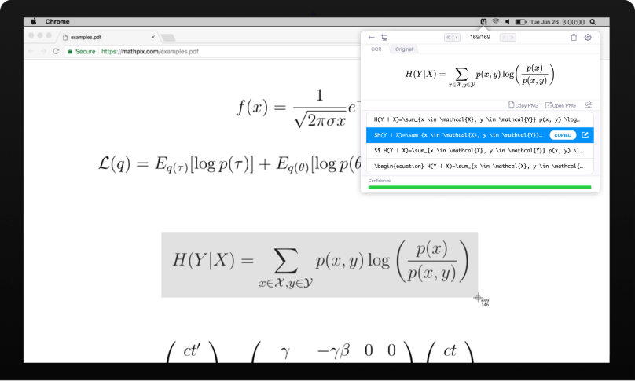

* content
{:toc}

## Mathpix					

### 简介

Mathpix（全名Mathpix Snipping Tool）是一款可以运行在主流的平台上的公式提取软件，其底层使用机器学习算法进行识别，准确率相当之高。目前，最新版的Mathpix需要注册登录才能使用，注册地址点击右侧链接即可，注册完成该网站即可下载对于平台软件包。

 [注册链接](https://accounts.mathpix.com/signup?referral_code=MSBcUF9eU9){:.btn} [官网链接](https://mathpix.com/){:.btn}

对于工科生，平常我们写论文或是博客文章，最麻烦的就是数学公式。尽管Mathtype提供了一个较为不错的可视化公式编辑器但是对于很多人而言，Latex语法写公式更加快捷且操作上限高。

但是复杂的Latex语法从头开始写公式似乎有些复杂，很多时候我们希望在一些公式的基础上进行修改，但是无法获取论文或者网页的公式源码，现在Mathpix解决了这个问题，只要是图片，无论是**论文截图、网页截图、手写的公式**，Mathpix都可以以较高的准确率识别出来，整理成多种格式的代码（Latex公式、Markdown公式），可以插入到Markdown、Word、Latex文档中。

## 效果预览

{:.img-fixed-50}

{:.img-fixed-50}

{:.img-default}





